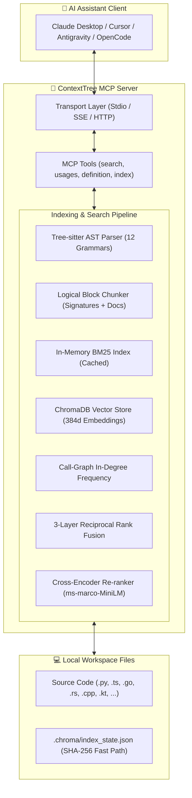

<div align="center">

# 🌳 ContextTree MCP

**Local Deep Semantic & Hybrid Code Search Engine for AI Assistants**  
*Powered by tree-sitter AST logical parsing, local embeddings, 3-layer RRF ranking & Cross-Encoder re-ranking.*

[](https://github.com/chelslava/mcp-context-tree/releases)
[](https://www.python.org/)
[](https://modelcontextprotocol.io)
[](https://github.com/chelslava/mcp-context-tree/actions)
[](https://github.com/astral-sh/ruff)
[](LICENSE)
[](#privacy--security)
[](README.ru.md)

<p align="center">
  <a href="#key-features">Key Features</a> •
  <a href="#supported-languages">Languages</a> •
  <a href="#architecture">Architecture</a> •
  <a href="#quick-start">Quick Start</a> •
  <a href="#client-configuration">Client Configs</a> •
  <a href="#mcp-tools-reference">MCP Tools</a> •
  <a href="#search-algorithm">Search Algorithm</a>
</p>

</div>

---

## 💡 Why ContextTree MCP?

Standard semantic search tools split code into arbitrary line or token windows, breaking function contexts and hallucinating definitions. **ContextTree MCP** provides LLMs with true **structural intelligence** of your codebase:

- 🧩 **AST Logical Block Extraction:** Indexes complete, meaningful units (functions, methods, classes, structs, traits) preserving docstrings and signatures.
- 🏢 **Multi-Repository Unified Indexing:** Seamlessly index and search across multiple repositories or multi-root workspaces in a single session.
- ⚡ **3-Layer Hybrid Search (RRF):** Blends dense vectors (`sentence-transformers/all-MiniLM-L6-v2`), BM25 lexical token matching (`camelCase`/`snake_case`), and **Call-Graph In-Degree Ranking**.
- 🎯 **Cross-Encoder 2nd-Stage Re-ranking:** Joint cross-attention re-scoring (`rerank=True`) for maximum precision on nuanced queries.
- 🔍 **Zero-Hallucination Code Navigation:** Real AST call-site tracking (`find_ast_usages`) and cross-file definition jump (`go_to_definition`).
- 🔄 **Incremental Indexing & Watch Mode:** SHA-256 state tracking with 500ms debounced filesystem watcher across multiple workspaces.
- 🌐 **Flexible Transports:** Standard `stdio`, `SSE` over HTTP, and `Streamable HTTP`.
- 🔒 **100% Offline & Private:** Zero cloud dependencies, zero external API calls, zero telemetry.

---

## 🌐 Supported Languages (12 Languages)

| Language | Extensions | Extracted AST Constructs |
|:---|:---|:---|
| **Python** | `.py` | Functions, decorated definitions, classes, methods, docstrings (PEP-257) |
| **TypeScript / TSX** | `.ts`, `.tsx`, `.mts`, `.cts` | Functions, arrow functions, methods, class/interface signatures, JSDoc |
| **JavaScript / JSX** | `.js`, `.jsx`, `.mjs`, `.cjs` | Functions, arrow functions, methods, class signatures, JSDoc |
| **Go** | `.go` | Functions, receiver methods, struct/interface types, package comments |
| **Rust** | `.rs` | Functions, `impl` methods, structs, traits, `///` documentation |
| **C#** | `.cs` | Methods, constructors, classes, interfaces, structs, `/// <summary>` XML-docs |
| **Java** | `.java` | Methods, constructors, classes, interfaces, records, Javadoc |
| **C** | `.c`, `.h` | Functions, structs, unions, enums, declarator unpacking, comments |
| **C++** | `.cpp`, `.hpp`, `.cc`, `.cxx`, `.hh`, `.hxx` | Methods, classes, structs, namespaces, destructors, doc comments |
| **Kotlin** | `.kt`, `.kts` | Functions, classes, objects, member methods, KDoc comments |
| **Swift** | `.swift` | Functions, methods, classes, structs, protocols, enums, Swift-doc |

---

## 🏗️ Architecture



---

## 🚀 Quick Start

### Prerequisites
- Python **3.12+**
- [`uv`](https://docs.astral.sh/uv/) (strongly recommended) or standard `pip`

### 1. Installation

```bash
# Clone the repository
git clone https://github.com/chelslava/mcp-context-tree.git
cd mcp-context-tree

# Install dependencies and local package via uv
uv sync
```

### 2. Running ContextTree MCP

```bash
# Standard MCP stdio mode (default for AI desktop clients)
uv run context-tree

# Server-Sent Events (SSE) HTTP transport on port 8000
uv run context-tree --transport sse --host 127.0.0.1 --port 8000

# Streamable HTTP transport
uv run context-tree --transport streamable-http --port 8000

# Standalone Watch Mode (continuously indexes workspace on save)
uv run context-tree --watch /path/to/project
```

---

## ⚙️ Client Configuration

### Claude Desktop
Add to your `claude_desktop_config.json`:

```json
{
  "mcpServers": {
    "context-tree": {
      "command": "uv",
      "args": [
        "run",
        "--directory",
        "D:/Repo/mcp-context-tree",
        "context-tree"
      ]
    }
  }
}
```

### Cursor IDE / Windsurf
Add to `.cursor/mcp.json` or Cursor MCP Settings:

```json
{
  "mcpServers": {
    "context-tree": {
      "command": "uv",
      "args": ["run", "--directory", "/absolute/path/to/mcp-context-tree", "context-tree"]
    }
  }
}
```

### Google Antigravity / Remote SSE Setup
If using network transport (`--transport sse`):

```json
{
  "mcpServers": {
    "context-tree": {
      "url": "http://127.0.0.1:8000/sse"
    }
  }
}
```

---

## 🛠️ MCP Tools Reference

### 1. `index_workspace`
Scans the project directory, computes SHA-256 hashes, applies `.gitignore` rules, and incrementally updates the local ChromaDB vector store.

```json
// Parameters
{
  "directory_path": "."
}

// Response
{
  "status": "ok",
  "workspace": "/path/to/project",
  "added": 12,
  "modified": 2,
  "deleted": 0,
  "unchanged": 85,
  "indexed_chunks": 340,
  "total_in_store": 340
}
```

### 2. `semantic_search`
Executes deep code search across the workspace with live snippet resolution from disk.

```json
// Parameters
{
  "query": "how to verify and refresh JWT authentication tokens",
  "directory_path": ".",
  "limit": 5,
  "mode": "hybrid",   // "hybrid" | "semantic" | "keyword"
  "rerank": true      // Optional 2nd-stage Cross-Encoder re-ranking
}

// Response
{
  "results": [
    {
      "file": "src/auth/service.py",
      "type": "method",
      "class": "AuthService",
      "name": "verify_jwt_token",
      "start_line": 45,
      "end_line": 68,
      "score": 0.9624,
      "code": "def verify_jwt_token(self, token: str) -> Claims:\n    ..."
    }
  ]
}
```

### 3. `find_ast_usages`
Performs true AST-level call-site resolution for functions, methods, and classes, ignoring string literals and comments.

```json
// Parameters
{
  "symbol_name": "AuthService.verify_jwt_token",
  "directory_path": ".",
  "limit": 50
}

// Response
{
  "usages": [
    {
      "file": "src/api/routes.py",
      "line": 104,
      "preview": "claims = auth_service.verify_jwt_token(token)"
    }
  ]
}
```

### 4. `go_to_definition`
Instantly resolves the exact AST declaration/definition location of a symbol across all 12 supported languages.

```json
// Parameters
{
  "symbol_name": "UserRepo.getUser",
  "directory_path": ".",
  "limit": 20
}

// Response
{
  "definitions": [
    {
      "file": "src/models/User.kt",
      "language": "kotlin",
      "type": "method",
      "name": "getUser",
      "class": "UserRepo",
      "start_line": 14,
      "end_line": 22,
      "code": "fun getUser(id: String): User? {\n    ...",
      "docstring": "/** Retrieve user by identifier */"
    }
  ]
}
```

---

## 🔬 Search & Ranking Algorithm

ContextTree MCP uses a **3-Layer Reciprocal Rank Fusion (RRF)** formula to merge dense semantic embeddings, exact lexical matches, and architectural importance:

$$RRF(d) = \frac{w_{vec}}{k + rank_{vec}(d)} + \frac{w_{bm25}}{k + rank_{bm25}(d)} + \frac{w_{graph}}{k + rank_{graph}(d)}$$

Where:
- $k = 60$ (smoothing constant)
- $w_{vec} = 1.0$ (dense semantic similarity via `all-MiniLM-L6-v2`)
- $w_{bm25} = 1.0$ (Robertson-Spärck Jones BM25 with `camelCase`/`snake_case` tokenization)
- $w_{graph} = 0.5$ (in-degree call frequency boost: heavily referenced core symbols float to the top)
- **Cross-Encoder Layer:** When `rerank=True`, candidate chunks pass through joint self-attention (`cross-encoder/ms-marco-MiniLM-L-6-v2`) for fine-grained semantic scoring.

---

## 🔒 Privacy & Security

- **100% Local Execution:** All parsing, embedding generation, and vector indexing happen entirely on your machine.
- **Zero Cloud Network Calls:** Never transmits source code or embeddings to external APIs.
- **Respects Ignore Rules:** Honors root and nested `.gitignore` rules alongside built-in filters for `target/`, `node_modules/`, `bin/`, `obj/`, `.git/`, `.venv/`.

---

## 🧪 Testing & Quality

ContextTree MCP maintains **100% pass rate** across its test suite and strict linting:

```bash
# Run test suite (60 unit & integration tests)
uv run pytest

# Run linter and formatting check
uv run ruff check .
uv run ruff format --check .
```

---

## 📄 License

Distributed under the **MIT License**. See [LICENSE](LICENSE) for details.

<div align="center">
  <sub>Built with ❤️ for AI engineers and developers. Star ⭐ this repository if you find it helpful!</sub>
</div>
