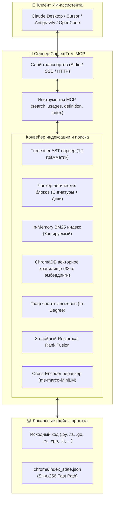

<div align="center">

# 🌳 ContextTree MCP

**Локальный движок глубокого семантического и гибридного поиска по коду для ИИ-ассистентов**  
*На базе tree-sitter AST-парсинга, локальных эмбеддингов, 3-слойного RRF-ранжирования и Cross-Encoder реранкинга.*

[](https://github.com/chelslava/mcp-context-tree/releases)
[](https://www.python.org/)
[](https://modelcontextprotocol.io)
[](https://github.com/chelslava/mcp-context-tree/actions)
[](https://github.com/astral-sh/ruff)
[](LICENSE)
[](#приватность-и-безопасность)
[](README.md)

<p align="center">
  <a href="#основные-возможности">Возможности</a> •
  <a href="#поддерживаемые-языки-12-языков">Языки</a> •
  <a href="#архитектура">Архитектура</a> •
  <a href="#быстрый-старт">Быстрый старт</a> •
  <a href="#подключение-к-клиентам">Настройка клиентов</a> •
  <a href="#инструменты-mcp">Инструменты MCP</a> •
  <a href="#алгоритм-поиска-и-ранжирования">Алгоритм поиска</a>
</p>

</div>

---

## 💡 Почему ContextTree MCP?

Обычные инструменты семантического поиска нарезают код на произвольные окна строк или токенов, разрывая функции и приводя к галлюцинациям модели. **ContextTree MCP** предоставляет LLM настоящее **структурное понимание** кодовой базы:

- 🧩 **AST-парсинг логических блоков:** Индексирует целостные конструкции (функции, методы, классы, структуры, трейты, интерфейсы) с сохранением сигнатур и документации.
- ⚡ **3-слойный гибридный поиск (RRF):** Объединяет векторный поиск (`sentence-transformers/all-MiniLM-L6-v2`), лексический BM25 (`camelCase`/`snake_case`) и **Call-Graph ранжирование по частоте вызовов**.
- 🎯 **Двухэтапный Cross-Encoder реранкинг:** Совместное full cross-attention переранжирование (`rerank=True`) для максимальной точности сложных запросов.
- 🔍 **Навигация без галлюцинаций:** Поиск реальных мест вызовов в AST (`find_ast_usages`) и точный переход к определению символа (`go_to_definition`).
- 🔄 **Инкрементальность и Watch Mode:** Отслеживание изменений по SHA-256 и мгновенная переиндексация на лету с дебаунсом 500мс.
- 🌐 **Сетевые транспорты:** Стандартный `stdio`, `SSE` по HTTP и `Streamable HTTP`.
- 🔒 **100% офлайн и приватность:** Никаких внешних API-запросов, телеметрии и передачи кода в облако.

---

## 🌐 Поддерживаемые языки (12 языков)

| Язык | Расширения | Индексируемые AST-конструкции |
|:---|:---|:---|
| **Python** | `.py` | Функции, декорированные определения, классы, методы, docstring (PEP-257) |
| **TypeScript / TSX** | `.ts`, `.tsx`, `.mts`, `.cts` | Функции, стрелочные функции, методы, сигнатуры классов/интерфейсов, JSDoc |
| **JavaScript / JSX** | `.js`, `.jsx`, `.mjs`, `.cjs` | Функции, стрелочные функции, методы, классы, JSDoc |
| **Go** | `.go` | Функции, методы ресиверов, структуры, интерфейсы, комментарии пакетов |
| **Rust** | `.rs` | Функции, `impl`-методы, структуры, трейты, документация `///` |
| **C#** | `.cs` | Методы, конструкторы, классы, интерфейсы, структуры, `/// <summary>` XML-doc |
| **Java** | `.java` | Методы, конструкторы, классы, интерфейсы, рекорды, Javadoc |
| **C** | `.c`, `.h` | Функции, структуры, объединения, enum, распаковка деклараторов, комментарии |
| **C++** | `.cpp`, `.hpp`, `.cc`, `.cxx`, `.hh`, `.hxx` | Методы, классы, структуры, пространства имен, деструкторы, комментарии |
| **Kotlin** | `.kt`, `.kts` | Функции, классы, объекты, методы, комментарии KDoc |
| **Swift** | `.swift` | Функции, методы, классы, структуры, протоколы, enum, Swift-doc |

---

## 🏗️ Архитектура



---

## 🚀 Быстрый старт

### Требования
- Python **3.12+**
- [`uv`](https://docs.astral.sh/uv/) (настоятельно рекомендуется) или стандартный `pip`

### 1. Установка

```bash
# Клонирование репозитория
git clone https://github.com/chelslava/mcp-context-tree.git
cd mcp-context-tree

# Установка зависимостей и локального пакета через uv
uv sync
```

### 2. Запуск ContextTree MCP

```bash
# Стандартный режим MCP stdio (для десктопных клиентов)
uv run context-tree

# Сетевой HTTP-транспорт Server-Sent Events (SSE) на порту 8000
uv run context-tree --transport sse --host 127.0.0.1 --port 8000

# Streamable HTTP транспорт
uv run context-tree --transport streamable-http --port 8000

# Автономный режим наблюдения (авто-индексация при сохранении файлов)
uv run context-tree --watch /путь/к/проекту
```

---

## ⚙️ Подключение к клиентам

### Claude Desktop
Добавьте в `claude_desktop_config.json`:

```json
{
  "mcpServers": {
    "context-tree": {
      "command": "uv",
      "args": [
        "run",
        "--directory",
        "D:/Repo/mcp-context-tree",
        "context-tree"
      ]
    }
  }
}
```

### Cursor IDE / Windsurf
Добавьте в `.cursor/mcp.json` или в настройки Cursor MCP:

```json
{
  "mcpServers": {
    "context-tree": {
      "command": "uv",
      "args": ["run", "--directory", "/абсолютный/путь/к/mcp-context-tree", "context-tree"]
    }
  }
}
```

### Google Antigravity / Сетевой SSE-режим
При запуске сервера с флагом `--transport sse`:

```json
{
  "mcpServers": {
    "context-tree": {
      "url": "http://127.0.0.1:8000/sse"
    }
  }
}
```

---

## 🛠️ Инструменты MCP

### 1. `index_workspace`
Сканирует каталог проекта, вычисляет хэши SHA-256, учитывает `.gitignore` и инкрементально обновляет локальную базу ChromaDB.

```json
// Параметры
{
  "directory_path": "."
}

// Ответ
{
  "status": "ok",
  "workspace": "/путь/к/проекту",
  "added": 12,
  "modified": 2,
  "deleted": 0,
  "unchanged": 85,
  "indexed_chunks": 340,
  "total_in_store": 340
}
```

### 2. `semantic_search`
Выполняет глубокий поиск по кодовой базе со считыванием актуальных сниппетов прямо с диска.

```json
// Параметры
{
  "query": "проверка и обновление JWT токенов авторизации",
  "directory_path": ".",
  "limit": 5,
  "mode": "hybrid",   // "hybrid" | "semantic" | "keyword"
  "rerank": true      // Опциональный 2-й этап Cross-Encoder реранкинга
}

// Ответ
{
  "results": [
    {
      "file": "src/auth/service.py",
      "type": "method",
      "class": "AuthService",
      "name": "verify_jwt_token",
      "start_line": 45,
      "end_line": 68,
      "score": 0.9624,
      "code": "def verify_jwt_token(self, token: str) -> Claims:\n    ..."
    }
  ]
}
```

### 3. `find_ast_usages`
Находит реальные вызовы функций, методов и классов на уровне AST (игнорируя строковые литералы и комментарии).

```json
// Параметры
{
  "symbol_name": "AuthService.verify_jwt_token",
  "directory_path": ".",
  "limit": 50
}

// Ответ
{
  "usages": [
    {
      "file": "src/api/routes.py",
      "line": 104,
      "preview": "claims = auth_service.verify_jwt_token(token)"
    }
  ]
}
```

### 4. `go_to_definition`
Мгновенно находит точное место объявления/определения символа по всем 12 поддерживаемым языкам.

```json
// Параметры
{
  "symbol_name": "UserRepo.getUser",
  "directory_path": ".",
  "limit": 20
}

// Ответ
{
  "definitions": [
    {
      "file": "src/models/User.kt",
      "language": "kotlin",
      "type": "method",
      "name": "getUser",
      "class": "UserRepo",
      "start_line": 14,
      "end_line": 22,
      "code": "fun getUser(id: String): User? {\n    ...",
      "docstring": "/** Retrieve user by identifier */"
    }
  ]
}
```

---

## 🔬 Алгоритм поиска и ранжирования

ContextTree MCP использует формулу **3-слойного Reciprocal Rank Fusion (RRF)** для объединения плотных эмбеддингов, точного лексического поиска и архитектурного веса:

$$RRF(d) = \frac{w_{vec}}{k + rank_{vec}(d)} + \frac{w_{bm25}}{k + rank_{bm25}(d)} + \frac{w_{graph}}{k + rank_{graph}(d)}$$

Где:
- $k = 60$ (константа сглаживания)
- $w_{vec} = 1.0$ (векторное сходство через `all-MiniLM-L6-v2`)
- $w_{bm25} = 1.0$ (BM25 с токенизацией `camelCase`/`snake_case`)
- $w_{graph} = 0.5$ (буст по частоте вызовов: ключевые сервисы и методы поднимаются выше)
- **Слой Cross-Encoder:** При `rerank=True` отобранные кандидаты оцениваются моделью `cross-encoder/ms-marco-MiniLM-L-6-v2` через совместное внимание пары `(query, document)`.

---

## 🔒 Приватность и безопасность

- **100% локальное исполнение:** Парсинг, векторизация и база хранятся только на локальной машине.
- **Никаких сетевых запросов в облако:** Исходный код и эмбеддинги никогда не покидают ваше устройство.
- **Учет правил игнорирования:** Поддержка `.gitignore` и фильтрация каталогов `target/`, `node_modules/`, `bin/`, `obj/`, `.git/`, `.venv/`.

---

## 🧪 Тестирование и качество

ContextTree MCP обеспечивает **100% успешное прохождение** всех тестов и строгий контроль стиля:

```bash
# Запуск набора тестов (60 unit и integration тестов)
uv run pytest

# Проверка линтером и форматтером
uv run ruff check .
uv run ruff format --check .
```

---

## 📄 Лицензия

Распространяется под лицензией **MIT**. Подробнее см. в [LICENSE](LICENSE).

<div align="center">
  <sub>Создано с ❤️ для ИИ-инженеров и разработчиков. Поставьте ⭐ репозиторию, если проект вам полезен!</sub>
</div>
